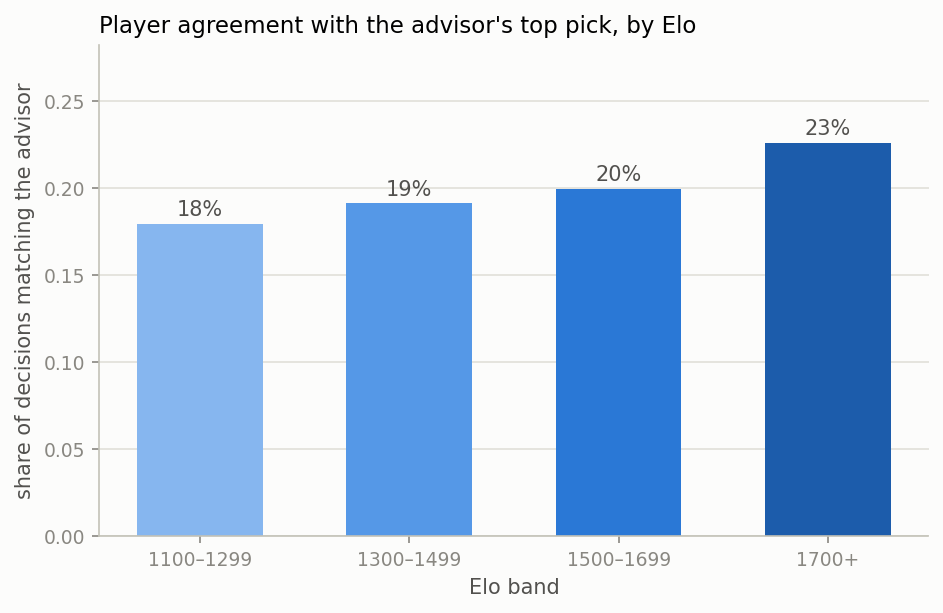
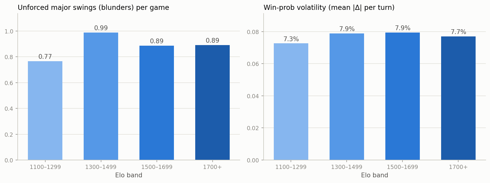

# Pokémon Showdown Win Probability Engine

[](https://github.com/DanielAntares/showdown-battle-analytics/actions/workflows/ci.yml)

Turn-by-turn **win probability model** for competitive Pokémon battles — the "ESPN win
probability chart," but for [Pokémon Showdown](https://pokemonshowdown.com/) ranked ladder
games. Given the state of a battle at the start of any turn (HP remaining, Pokémon fainted,
entry hazards, stat boosts, weather, …), the model estimates the probability that Player 1
goes on to win.

**Why this is interesting as a data problem:**

- Showdown publishes full battle replays and monthly usage statistics — arguably the most
  open competitive-gaming dataset outside chess.
- Battles are **partially observable**: movesets, items, and abilities are revealed
  gradually, so the state representation itself is a modeling decision.
- Win probability is a **calibration** problem, not just a classification problem: a
  prediction of 70% should come true 70% of the time. That makes the evaluation story
  (log loss, Brier score, reliability curves) richer than plain accuracy.

## Data sources

| Source | What | Access |
|---|---|---|
| `replay.pokemonshowdown.com/search.json` | Recent rated replays per format (51/page, paginate back in time with `before=`) | public JSON API |
| `replay.pokemonshowdown.com/<id>.json` | Full battle log (sim protocol) + player ratings | public JSON API |
| `smogon.com/stats/<YYYY-MM>/chaos/` | Monthly usage stats: usage %, movesets, teammate co-occurrence | public JSON files |

Default format: **Gen 9 OU** (the flagship 6v6 singles tier). Configurable in
[config.yaml](config.yaml).

## Pipeline

```
scrape.py ──> data/raw/replays/*.json      (rated replays, rate-limited, resumable)
parser.py ──> per-turn state snapshots     (sim protocol -> structured battle state)
build_dataset.py ──> data/processed/turns.parquet   (one row per turn, label = p1 won)
```

Each turn-start snapshot captures, per side: Pokémon remaining/fainted/revealed, total team
HP, active Pokémon (species, HP, status, stat boosts), entry hazards (Stealth Rock, Spikes,
Toxic Spikes, Sticky Web), screens (Reflect / Light Screen / Aurora Veil / Tailwind) — plus
global weather, terrain, Trick Room, turn number, and player Elo ratings.

## Results

27,840 rated games collected (June–July 2026) → 686k turn snapshots. Models train on
**dataset v2**: the 18,744 games rated 1300+ (14.3k train, 4.4k strictly-newer test);
lower-rated games stay on disk for cross-skill analysis.

| Model | Log loss ↓ | Brier ↓ | AUC ↑ |
|---|---|---|---|
| Always 50% | 0.6931 | 0.2500 | 0.500 |
| Elo difference only | 0.6934 | 0.2501 | 0.497 |
| Battle-state logistic (6 features) | 0.6330 | 0.2215 | 0.691 |
| **LightGBM (full snapshot)** | **0.6089** | **0.2116** | **0.723** |

The LightGBM model is trained with **p1/p2 mirror augmentation** (every position is also
seen from the other seat with the label flipped — doubles the sample and enforces
symmetry; worth −0.010 log loss on its own) plus turn-momentum and team-health features.


Its probabilities are **already well-calibrated without a calibration layer**: fitting
Platt or isotonic calibration on a validation holdout was tested and both *worsened*
held-out log loss (raw 0.609 vs Platt 0.611 vs isotonic 0.625), because the raw scores
are already near the diagonal (left panel) and any layer overfits the train→test time
gap. The training script keeps the comparison and self-selects "none."

Three findings worth calling out:

1. **Pre-game Elo is worthless at higher ladder** — on the 1300+ benchmark the Elo-only
   baseline scores *below* a coin flip (AUC 0.497). Matchmaking equalizes skill so
   thoroughly that all predictive signal must come from the battle state itself.
2. **The model reads matchups, not just scoreboards**: the two active-species features
   carry 44% of total split gain, alongside the HP differential (27%) — the model has
   effectively learned type/threat matchup knowledge from co-occurrence with outcomes.
3. **Uncertainty behaves like it should**: log loss falls from 0.68 in turns 1–5 toward
   0.55 late-game, and the reliability curves track the diagonal — a predicted 70% wins
   ~70% of the time.
4. **Negative results, honestly reported.** Two feature ideas were tested and rejected on
   validation, not quietly kept: (a) explicit Pokédex knowledge (base stats + type-chart
   advantage) made validation *worse* (0.591 → 0.593), even on rare-species turns — the
   species categoricals already subsume stats/typing for anything seen in training; and
   (b) item/ability reveal counts raised test log loss 0.609 → 0.613 and dropped AUC —
   they mostly proxy game progress, which `turn` and HP already capture. Domain knowledge
   only pays when the model couldn't have learned it from data volume alone.
5. **A sequence model didn't beat the snapshot.** A GRU over the turn sequence (numeric
   features + embeddings for both active species, predicting the winner from every
   prefix) reached 0.627 test log loss / 0.697 AUC — *worse* than the snapshot LightGBM's
   0.609 / 0.723 at comparable effort ([src/seq_experiment.py](src/seq_experiment.py)).
   The likely reason: the hand-built momentum features already hand the tree model the
   temporal signal that matters, so explicit sequence modeling adds little. (Fair
   caveats: the GRU trained on a subsample without the mirror augmentation, CPU-only.)

### Team inference (Phase 5)

The second model answers the hidden-information question: **given k known members of a
team, which species are the other 6−k?** A smoothed co-occurrence naive Bayes, fit on
28,607 training rosters and evaluated on 8,874 strictly-newer test teams (~500 candidate
species per guess):

| Members revealed | Top-1 hit rate | Recall@10 | Usage-baseline top-1 |
|---|---|---|---|
| 1 | 36.3% | 40.7% | 26.6% |
| 2 | 40.0% | 51.2% | 22.6% |
| 3 | 41.1% | 57.7% | 17.9% |
| 4 | 38.6% | 63.0% | 12.9% |

Note the crossing dynamics: the usage-only baseline *degrades* as more is revealed
(the popular picks get used up), while the model *improves* — evidence it reads team
archetypes, not just popularity.

### Set & moveset prediction

A companion model predicts, for any species, its **likely moves, item, ability, Tera
type, and EV/nature spread** before the Pokémon reveals anything — distilled from
Smogon's monthly usage statistics (moves, spreads, items per species at a rating
baseline). Great Tusk comes back as Jolly 252 Atk / 252 Spe with Rapid Spin / Headlong
Rush / Ice Spinner; Gholdengo as a Timid special attacker (Attack IV inferred to 0).
This feeds the advisor two ways: unrevealed moves become real options in the search,
and the predicted spread gives the damage engine believable speed tiers and bulk. As
the battle reveals moves they're kept and the rest of the set is re-predicted around
them. (Honest limit: usage stats are marginal per species, so predictions aren't
conditioned on the specific team — only on what the battle has revealed.)

## Demo app

`streamlit run app.py` → paste any Showdown replay URL (or hit "Try an example") and get:

- the **win-probability timeline** across the battle, with the biggest swings highlighted
- **key moments** decoded from the log ("Turn 37 · +43% — GamingCommence lost a Pokémon;
  GamingCommence Terastallized")
- the model's verdict: final read on the actual winner and the turn from which it
  called the game without flipping again

Plus a **Live spectator** tab — paste a battle link or a username (or grab the
top-rated game on the ladder right now) and watch the win-probability chart update
in real time as the battle is played — and a **Team Predictor** tab: pick 1–5 known
members of any team and get the most likely hidden teammates, ranked.

Both battle views include an **Advisor** panel: at any chosen turn (or live, right
now), it recommends the **best action by 1-ply minimax** — every combination of the
player's options and the opponent's plausible responses is simulated with a damage
engine and scored by the win-probability model, and the pick is the action with the
best worst-case outcome. Crucially, it reasons about **moves a Pokémon hasn't shown
yet**: unrevealed moves and EV/nature spreads are predicted from ladder usage stats,
so the advisor evaluates a Clodsire's likely Earthquake even when only its Toxic has
been revealed. The panel shows the predicted sets it's assuming.

It also recommends **which Pokémon to lead with**: at team preview both full teams are
known, so each of your six is scored as the lead against all six of the opponent's
possible leads, and the pick with the best average opening wins. This shows up
retrospectively in the replay analyzer ("who should have started?") and live at team
preview, before you've chosen.

Launch on Windows with `run.bat`, or `python -m streamlit run app.py` (use `python -m`;
a bare `streamlit` may resolve to a different install).

### Is the advisor's advice any good?

The advisor is validated against real player decisions ([src/validate_advisor.py](src/validate_advisor.py)):
on ~2,800 held-out decision turns we reconstruct what the player saw, ask the advisor for
its top action, and compare it to what the player actually did.

| Elo band | Agreement with advisor | Win rate when agreeing | Win rate when deviating |
|---|---|---|---|
| 1100–1299 | 18% | **63%** | 50% |
| 1300–1499 | 19% | 51% | 51% |
| 1500–1699 | 20% | 51% | 51% |
| 1700+ | 23% | 50% | 50% |



Two honest findings. First, **agreement rises with skill** (18% → 23%) — stronger players
play the advisor's pick more often, evidence the recommendation tracks good play rather
than being a model artifact. Second, and more striking, **the advisor's edge is
concentrated at low ladder**: among 1100s, matching it is associated with a 63% win rate
vs 50% for deviating (a 13-point gap), and that gap closes to nothing by 1700+. That is
what you'd expect from a genuinely useful coach — it catches the mistakes weaker players
actually make, while strong players' deviations are informed (hidden info, long-game
plans) and don't cost them. (These are associations, not causal effects; agreeing also
correlates with already being in a clearer position.)

### Does skill change the shape of a game? (Phase 10)

Sampling 600 games per Elo band (using the sub-1300 games kept outside the training
set) and replaying them through the model:

| Elo band | Blunders/game | per 100 turns | Volatility (mean \|Δ\|/turn) | Mean turns |
|---|---|---|---|---|
| 1100–1299 | 0.77 | 3.3 | 7.3% | 23.4 |
| 1300–1499 | 0.99 | 4.0 | 7.9% | 25.0 |
| 1500–1699 | 0.89 | 3.5 | 7.9% | 25.3 |
| 1700+ | 0.89 | 3.1 | 7.7% | 29.0 |



**The naive hypothesis — "higher Elo means smoother win-prob curves" — does not
survive contact with the data.** Raw blunder counts are nearly flat, and low-Elo games
actually *look* calmest. The resolution is a selection effect: low-ladder games snowball
into early blowouts, and a decided game can't swing (the probability is already pinned);
high-ladder games stay contested longer (29 vs 23 turns), which is where swings are
even possible. Only after normalizing per turn does the expected gradient appear — and
it's mild (3.1 vs 3.3–4.0 blunder-sized swings per 100 turns). Skill shows up less as
"fewer big swings" and more as "longer, closer games."

## Roadmap

- [x] **Phase 0 — feasibility**: verify replay API pagination, log format, usage stats availability
- [x] **Phase 1 — data collection**: resumable scraper; 19,208-game corpus across four weekly windows
- [x] **Phase 2 — parsing**: sim-protocol parser → turn-level dataset with tests against real replays
- [x] **Phase 3 — modeling**: baselines → LightGBM; time-based game-level split; log loss,
      Brier, AUC, reliability diagrams; feature importance
- [x] **Phase 4 — Streamlit app**: paste a replay URL → win-probability timeline with
      key-moment detection, model verdict metrics, and revealed teams
- [x] **Phase 5 — team inference**: predict unrevealed team members from revealed ones
      via co-occurrence naive Bayes over training rosters; Team Predictor tab in the app
- [x] **Phase 6 — turn stories**: per-turn action tracking (moves, switches, faints, Tera)
      with luck events (crits, misses) separated, swing-severity grading in key moments
- [x] **Phase 7 — dataset v2**: 27.8k games collected, 18.7k at the 1300+ training floor
      (train filter `train_min_rating` keeps low-Elo games on disk for skill-band analysis)
- [x] **Phase 8 — live spectator mode**: attach to an ongoing public battle over
      Showdown's WebSocket (battle link, username lookup, or top-rated-now) and stream
      a live-updating win-prob chart; rooms replay history on join, so mid-game
      attachment catches up instantly
- [x] **Phase 9 — best-action search (v2)**: 1-ply minimax over the joint action
      matrix — every (my action × opponent response) pair is played out by an
      approximate battle engine (level-100 damage formula, STAB/type chart, boosts,
      burn/paralysis, speed & priority ordering, screens, weather, hazard chip,
      common utility effects) and scored by the win-prob model; the recommendation
      maximizes the worst case. Unrevealed moves and EV/nature/IV spreads are predicted
      from usage stats ([src/movesets.py](src/movesets.py)). v3 (open): swap the engine
      for Showdown's own simulator to add items, abilities, and exact mechanics
- [x] **Phase 10 — skill-band explorer**: blunder-rate and volatility analysis across
      Elo bands (results above); Elo-band example picker for replays and a minimum-Elo
      filter for live battles in the app
- [x] **Phase 11 — moveset/spread prediction**: predict a species' likely moves, item,
      ability, Tera, and EV/nature spread from usage stats ([src/movesets.py](src/movesets.py));
      feeds the advisor so it reasons about unrevealed moves
- [x] **Phase 12 — rigor & robustness**: advisor validation against real player decisions
      ([src/validate_advisor.py](src/validate_advisor.py)), calibration-method selection,
      a GRU sequence-model experiment ([src/seq_experiment.py](src/seq_experiment.py)),
      CI on every push, pinned dependencies

## Known modeling caveats

- Replays only exist for games someone uploaded → the corpus over-represents interesting
  games (mitigated by scraping the public search feed, which lists all rated uploads).
- Zoroark's Illusion and forme changes are handled by re-mapping on `|replace|` /
  `|detailschange|`; a few exotic mechanics (Court Change, boost-copying) are ignored in v1.
- Ratings are per-player ladder Elo at game time; unrated games are excluded.

## Setup

```bash
pip install -r requirements.txt
python -m src.scrape            # collect replays (resumable; ~1 req/s, be polite)
python -m src.build_dataset     # parse everything -> data/processed/turns.parquet
python -m src.train             # baselines + LightGBM -> models/, reports/figures/
pytest                          # test suite (also run in CI on every push)
streamlit run app.py            # interactive demo
```

Development deps (adds `pytest`) are in `requirements-dev.txt`; CI runs the suite on
every push via [.github/workflows/ci.yml](.github/workflows/ci.yml).

## Repository layout

```
├── config.yaml          # format, rating floor, scrape volume, paths
├── app.py               # Streamlit demo (replay URL -> win-prob timeline)
├── src/
│   ├── scrape.py        # replay search + download (resumable, rate-limited)
│   ├── parser.py        # sim protocol -> per-turn battle state snapshots
│   ├── usage_stats.py   # Smogon monthly chaos stats downloader
│   ├── build_dataset.py # raw replays -> turns.parquet
│   ├── features.py      # joins, differentials, encoding, time-based split
│   ├── train.py         # baselines + LightGBM, calibration evaluation
│   ├── predict.py       # saved model -> per-turn win probs + key moments
│   ├── teammates.py     # teammate co-occurrence inference (Phase 5)
│   ├── live.py          # WebSocket spectator: live battles -> the same parser
│   ├── advisor.py       # best-action 1-ply minimax + damage engine
│   ├── movesets.py      # predict moves / item / spread from usage stats
│   ├── usage_stats.py   # Smogon chaos stats downloader
│   ├── skill_bands.py   # blunder/volatility analysis across Elo bands
│   └── pokedex.py       # species stats, moves data, type chart
├── assets/              # distilled pokedex lookup (committed, used at runtime)
├── notebooks/           # EDA, modeling, evaluation
├── tests/               # parser unit tests + real replay fixtures
├── reports/figures/     # evaluation figures (committed)
├── models/              # trained model + feature metadata (git-ignored)
└── data/                # raw + processed (git-ignored)
```

## Acknowledgments

Battle data © their players, hosted by [Pokémon Showdown](https://pokemonshowdown.com/)
(open source, MIT). Usage statistics by [Smogon University](https://www.smogon.com/stats/).
This is a non-commercial portfolio/research project; the scraper is rate-limited to be a
polite API citizen.
