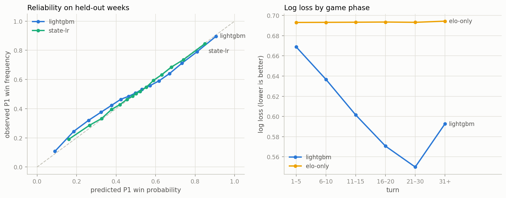

# Pokémon Showdown Win Probability Engine

Turn-by-turn **win probability model** for competitive Pokémon battles — the "ESPN win
probability chart," but for [Pokémon Showdown](https://pokemonshowdown.com/) ranked ladder
games. Given the state of a battle at the start of any turn (HP remaining, Pokémon fainted,
entry hazards, stat boosts, weather, …), the model estimates the probability that Player 1
goes on to win.

**Why this is interesting as a data problem:**

- Showdown publishes full battle replays and monthly usage statistics — arguably the most
  open competitive-gaming dataset outside chess.
- Battles are **partially observable**: movesets, items, and abilities are revealed
  gradually, so the state representation itself is a modeling decision.
- Win probability is a **calibration** problem, not just a classification problem: a
  prediction of 70% should come true 70% of the time. That makes the evaluation story
  (log loss, Brier score, reliability curves) richer than plain accuracy.

## Data sources

| Source | What | Access |
|---|---|---|
| `replay.pokemonshowdown.com/search.json` | Recent rated replays per format (51/page, paginate back in time with `before=`) | public JSON API |
| `replay.pokemonshowdown.com/<id>.json` | Full battle log (sim protocol) + player ratings | public JSON API |
| `smogon.com/stats/<YYYY-MM>/chaos/` | Monthly usage stats: usage %, movesets, teammate co-occurrence | public JSON files |

Default format: **Gen 9 OU** (the flagship 6v6 singles tier). Configurable in
[config.yaml](config.yaml).

## Pipeline

```
scrape.py ──> data/raw/replays/*.json      (rated replays, rate-limited, resumable)
parser.py ──> per-turn state snapshots     (sim protocol -> structured battle state)
build_dataset.py ──> data/processed/turns.parquet   (one row per turn, label = p1 won)
```

Each turn-start snapshot captures, per side: Pokémon remaining/fainted/revealed, total team
HP, active Pokémon (species, HP, status, stat boosts), entry hazards (Stealth Rock, Spikes,
Toxic Spikes, Sticky Web), screens (Reflect / Light Screen / Aurora Veil / Tailwind) — plus
global weather, terrain, Trick Room, turn number, and player Elo ratings.

## Results

27,840 rated games collected (June–July 2026) → 686k turn snapshots. Models train on
**dataset v2**: the 18,744 games rated 1300+ (14.3k train, 4.4k strictly-newer test);
lower-rated games stay on disk for cross-skill analysis.

| Model | Log loss ↓ | Brier ↓ | AUC ↑ |
|---|---|---|---|
| Always 50% | 0.6931 | 0.2500 | 0.500 |
| Elo difference only | 0.6934 | 0.2501 | 0.497 |
| Battle-state logistic (6 features) | 0.6330 | 0.2215 | 0.691 |
| **LightGBM (full snapshot)** | **0.6075** | **0.2112** | **0.725** |

The LightGBM model is trained with **p1/p2 mirror augmentation** (every position is also
seen from the other seat with the label flipped — doubles the sample and enforces
symmetry; worth −0.010 log loss on its own) plus turn-momentum and team-health features.



Three findings worth calling out:

1. **Pre-game Elo is worthless at higher ladder** — on the 1300+ benchmark the Elo-only
   baseline scores *below* a coin flip (AUC 0.497). Matchmaking equalizes skill so
   thoroughly that all predictive signal must come from the battle state itself.
2. **The model reads matchups, not just scoreboards**: the two active-species features
   carry 44% of total split gain, alongside the HP differential (27%) — the model has
   effectively learned type/threat matchup knowledge from co-occurrence with outcomes.
3. **Uncertainty behaves like it should**: log loss falls from 0.68 in turns 1–5 toward
   0.55 late-game, and the reliability curves track the diagonal — a predicted 70% wins
   ~70% of the time.
4. **A negative result, honestly reported**: injecting explicit Pokédex knowledge (base
   stats of both actives + type-chart advantage) made validation *worse* (0.591 → 0.593),
   even on rare-species turns. The species categorical features already subsume stats and
   typing for anything seen in training — domain knowledge only pays when the model
   couldn't have learned it from data volume alone ([src/pokedex.py](src/pokedex.py) is
   kept, tested, for future type-reasoning features).

### Team inference (Phase 5)

The second model answers the hidden-information question: **given k known members of a
team, which species are the other 6−k?** A smoothed co-occurrence naive Bayes, fit on
28,607 training rosters and evaluated on 8,874 strictly-newer test teams (~500 candidate
species per guess):

| Members revealed | Top-1 hit rate | Recall@10 | Usage-baseline top-1 |
|---|---|---|---|
| 1 | 36.3% | 40.7% | 26.6% |
| 2 | 40.0% | 51.2% | 22.6% |
| 3 | 41.1% | 57.7% | 17.9% |
| 4 | 38.6% | 63.0% | 12.9% |

Note the crossing dynamics: the usage-only baseline *degrades* as more is revealed
(the popular picks get used up), while the model *improves* — evidence it reads team
archetypes, not just popularity.

## Demo app

`streamlit run app.py` → paste any Showdown replay URL (or hit "Try an example") and get:

- the **win-probability timeline** across the battle, with the biggest swings highlighted
- **key moments** decoded from the log ("Turn 37 · +43% — GamingCommence lost a Pokémon;
  GamingCommence Terastallized")
- the model's verdict: final read on the actual winner and the turn from which it
  called the game without flipping again

Plus a **Team Predictor** tab: pick 1–5 known members of any team and get the most
likely hidden teammates, ranked with relative likelihoods.

## Roadmap

- [x] **Phase 0 — feasibility**: verify replay API pagination, log format, usage stats availability
- [x] **Phase 1 — data collection**: resumable scraper; 19,208-game corpus across four weekly windows
- [x] **Phase 2 — parsing**: sim-protocol parser → turn-level dataset with tests against real replays
- [x] **Phase 3 — modeling**: baselines → LightGBM; time-based game-level split; log loss,
      Brier, AUC, reliability diagrams; feature importance
- [x] **Phase 4 — Streamlit app**: paste a replay URL → win-probability timeline with
      key-moment detection, model verdict metrics, and revealed teams
- [x] **Phase 5 — team inference**: predict unrevealed team members from revealed ones
      via co-occurrence naive Bayes over training rosters; Team Predictor tab in the app
- [x] **Phase 6 — turn stories**: per-turn action tracking (moves, switches, faints, Tera)
      with luck events (crits, misses) separated, swing-severity grading in key moments
- [x] **Phase 7 — dataset v2**: 27.8k games collected, 18.7k at the 1300+ training floor
      (train filter `train_min_rating` keeps low-Elo games on disk for skill-band analysis)
- [ ] **Phase 8 — live spectator mode**: attach to an ongoing public battle over
      Showdown's WebSocket and stream the win-prob chart in real time — the live protocol
      is identical to replay logs, and the parser is already incremental (`feed()` per line)
- [ ] **Phase 9 — move advisor**: v1 ranks switch options by re-scoring the win-prob
      model on hypothetical states + type heuristics for moves; v2 wires Showdown's
      open-source sim as a local engine for true 1-ply search over the joint action
      matrix (the Future Sight AI architecture: evaluator + set inference + search)
- [ ] **Phase 10 — skill-band explorer**: pick example replays by Elo band; compare
      blunder rates and win-prob volatility across ratings (low vs mid vs high ladder)

## Known modeling caveats

- Replays only exist for games someone uploaded → the corpus over-represents interesting
  games (mitigated by scraping the public search feed, which lists all rated uploads).
- Zoroark's Illusion and forme changes are handled by re-mapping on `|replace|` /
  `|detailschange|`; a few exotic mechanics (Court Change, boost-copying) are ignored in v1.
- Ratings are per-player ladder Elo at game time; unrated games are excluded.

## Setup

```bash
pip install -r requirements.txt
python -m src.scrape            # collect replays (resumable; ~1 req/s, be polite)
python -m src.build_dataset     # parse everything -> data/processed/turns.parquet
python -m src.train             # baselines + LightGBM -> models/, reports/figures/
pytest                          # parser tests against bundled real-replay fixtures
streamlit run app.py            # interactive demo
```

## Repository layout

```
├── config.yaml          # format, rating floor, scrape volume, paths
├── app.py               # Streamlit demo (replay URL -> win-prob timeline)
├── src/
│   ├── scrape.py        # replay search + download (resumable, rate-limited)
│   ├── parser.py        # sim protocol -> per-turn battle state snapshots
│   ├── usage_stats.py   # Smogon monthly chaos stats downloader
│   ├── build_dataset.py # raw replays -> turns.parquet
│   ├── features.py      # joins, differentials, encoding, time-based split
│   ├── train.py         # baselines + LightGBM, calibration evaluation
│   ├── predict.py       # saved model -> per-turn win probs + key moments
│   ├── teammates.py     # teammate co-occurrence inference (Phase 5)
│   └── pokedex.py       # base stats + type chart (tested; see finding 4)
├── assets/              # distilled pokedex lookup (committed, used at runtime)
├── notebooks/           # EDA, modeling, evaluation
├── tests/               # parser unit tests + real replay fixtures
├── reports/figures/     # evaluation figures (committed)
├── models/              # trained model + feature metadata (git-ignored)
└── data/                # raw + processed (git-ignored)
```

## Acknowledgments

Battle data © their players, hosted by [Pokémon Showdown](https://pokemonshowdown.com/)
(open source, MIT). Usage statistics by [Smogon University](https://www.smogon.com/stats/).
This is a non-commercial portfolio/research project; the scraper is rate-limited to be a
polite API citizen.
